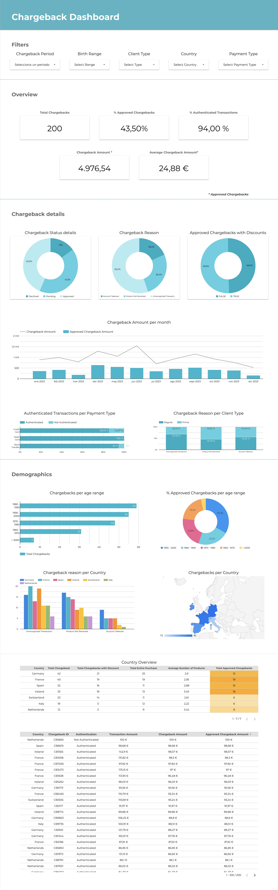

# **Chargeback Dashboard** 📊  

🔗 **Live Dashboard:** [Google Looker Studio](https://lookerstudio.google.com/s/ske7dRqPsI4)  

---

## **1. Context: What is a Chargeback?**  

A **chargeback** is a process where a customer disputes a transaction, requesting a review and possible reversal of the charge on their credit card, bank account, or store account.  

This typically happens when the customer:  
- Does not recognize a transaction  
- Suspects fraud  
- Did not receive the promised product or service  
- Is dissatisfied with the purchase for some reason  

### **How Chargebacks Work**  
Customers can dispute a transaction in **two ways**:  
1. **Through their bank**, which initiates the chargeback process.  
2. **Directly with the merchant**, where the transaction took place (e.g., Amazon).  

Regardless of how the chargeback is initiated, **both the merchant and the bank** conduct an investigation to determine if the transaction was fraudulent.  
- If fraud is confirmed ➝ The amount is refunded to the customer.  
- If no fraud is found ➝ The customer remains responsible for the transaction.  

---

## **2. Chargeback Dataset Components**  

The **chargeback dataset** contains various fields to analyze the process effectively.  

| **Field**                 | **Description** |
|---------------------------|-------------------------------------------------|
| **Chargeback ID**         | Unique identifier for each chargeback dispute. |
| **Transaction ID**        | Links the chargeback to the original transaction. |
| **Client ID**             | Identifies the customer involved in the chargeback. |
| **Chargeback Date**       | Date and time when the chargeback was recorded. |
| **Transaction Amount (€)** | Total value of the original transaction. |
| **Chargeback Amount (€)** | Amount disputed by the customer. |
| **Authentication**        | Indicates if the transaction was authenticated (e.g., CVV, biometric authentication). |
| **Payment Type**          | Payment method used (credit card, bank transfer, PayPal, etc.). |
| **Number of Products**    | Number of products/services in the transaction. |
| **Chargeback Reason**     | Reason for the chargeback (Unrecognized Transaction, Product Not Received, Account Takeover). |
| **Chargeback Status**     | Current status of the chargeback (Pending, Declined, Approved). |
| **Chargeback Scope**      | Indicates if the chargeback covers the full transaction or only part of it. |
| **Is Discounted Purchase** | Whether the original purchase had a discount. |

---

## **3. Chargeback Team's Objective**  

The main goal of Amazon’s **Chargeback Department** is to:  

✅ **Reduce chargebacks for authenticated transactions by 5%**  

To achieve this, a **Looker Studio dashboard** was created to monitor chargeback trends and improve decision-making.  

---

## **4. The Challenge: Creating a Chargeback Dashboard**  

### **Objective**  
Develop a **Looker Studio dashboard** for the chargeback team using the provided dataset.  

### **Steps Taken to Build the Dashboard**  

#### **1️⃣ Define Key Performance Indicators (KPIs)**  
To effectively monitor chargeback performance, we selected the following **KPIs**:  
- **Total Chargebacks** 📈 – Total number of chargebacks received, providing an overview of the situation.  
- **% Approved Chargebacks** ✅ – Percentage of chargebacks that were successfully approved.  
- **% Authenticated Transactions** 🔒 – Percentage of transactions that were authenticated out of the total.  
- **Total Chargeback Amount (€)** 💰 – Total financial value of chargebacks.  
- **Average Chargeback Amount (€)** 💳 – The average value of chargebacks for authenticated transactions.  
- **% Chargebacks with Discounts** 🏷 – The percentage of total chargebacks that originated from discounted purchases.  

Each KPI is displayed with total value visualizations in **Looker Studio**.  

#### **2️⃣ Implement Segmentation (Filters)**  
To allow users to **analyze chargeback data more effectively**, we added the following **filters**:  
- **Chargeback Period** 📅 – To analyze trends over a selected time range.  
- **Birth Range** 🏷 – To explore demographic trends based on customer age groups.  
- **Client Type** 👤 – To distinguish chargebacks between different customer categories.  
- **Country** 🌍 – To analyze chargeback distribution by region.  
- **Payment Type** 💳 – To assess chargeback frequency across different payment methods.  

These filters enable more precise and **interactive data exploration** within the dashboard.  

#### **3️⃣ Create Data Visualizations**  
To present the **KPIs effectively**, we selected various visualization types:  
✔ **Pie Charts** – Chargeback status, reasons, and chargebacks with discounts.  
✔ **Stacked Bar Charts** – Chargeback reasons per client type.  
✔ **Time Series Charts** – Monthly trends of total chargebacks and average transaction values.  
✔ **Geographical Heatmaps & Demographics** – Chargebacks by country and age range.  

#### **4️⃣ (Optional) Connect to the Customer Table**  
As an additional step, we considered **connecting the `client_data` table** if needed for deeper customer segmentation in KPIs and visualizations.  

---

## **5. Deliverables: How to Access the Dashboard**  

To ensure accessibility, we followed these steps:  
1. **Generated a shareable link:** The Looker Studio dashboard was configured to allow public access.  
2. **Verified accessibility:** Tested the link in an incognito browser to confirm unrestricted access.  
3. **Embedded the dashboard link in this document:**  

🔍 **View and interact with the dashboard here:** [Google Looker Studio Dashboard](https://lookerstudio.google.com/s/ske7dRqPsI4)  

---

## **Conclusion**  
This dashboard serves as a **valuable tool for Amazon’s chargeback team** to track and analyze disputes efficiently. By leveraging **KPIs, segmentation filters, and visualizations**, the team can:  
- Gain insights into **chargeback trends**.  
- Identify **high-risk payment methods and regions**.  
- Improve strategies to **reduce authenticated chargebacks by 5%**.  

This structured approach **enhances chargeback management** and supports data-driven decision-making. 🚀  

---
Here's a preview of the dashboard in case you don't need to interact with it:

