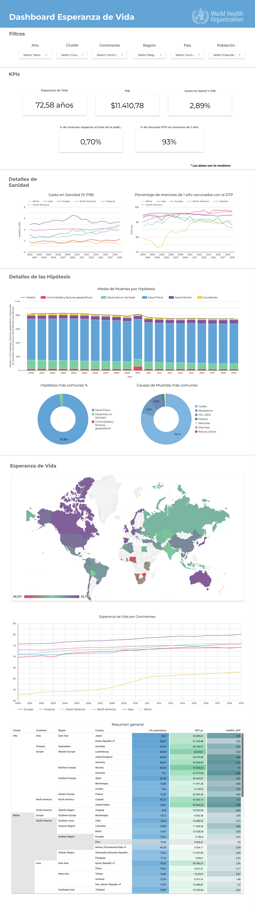

# Análisis de la Esperanza de Vida

## 1. Introducción

### Objetivo  
Este proyecto analiza los factores socioeconómicos y de salud pública que influyen en la esperanza de vida al nacer en distintas regiones del mundo. Con base en los resultados, se proporcionan recomendaciones clave para la Organización Mundial de la Salud (*WHO*) con el fin de mejorar los resultados de salud pública a nivel global.  

### Contexto  
La esperanza de vida es un indicador fundamental para evaluar el bienestar de las poblaciones. Comprender qué factores tienen mayor impacto en su variabilidad permite diseñar estrategias de salud pública más efectivas. En este análisis, se investigan elementos como el PIB per cápita, acceso a servicios de salud y tasas de mortalidad, entre otros.  

---

## 2. Metodología

### Enfoque del análisis  
Se ha realizado un análisis exploratorio de datos (*EDA*), acompañado de técnicas de *machine learning* y visualización de datos para detectar patrones y relaciones clave.  

### Fuentes de datos  
Los datos fueron obtenidos de dos fuentes principales:  
- **Our World in Data**  
- **World Bank**  

Se llevó a cabo un proceso exhaustivo de limpieza de datos, que incluyó la normalización de nombres de países y el tratamiento de valores nulos.  

### Herramientas utilizadas  
Para el análisis y modelado se emplearon las siguientes tecnologías:  

- **Python y sus librerías:**  
  - `NumPy`: Operaciones numéricas y manejo de arrays.  
  - `Pandas`: Manipulación y análisis de datos.  
  - `Matplotlib`, `Plotly`, `Seaborn`: Visualización de datos.  
  - `Scikit-learn`: Modelado de *machine learning* y *clustering*.  
  - `XGBoost`: Entrenamiento de modelos de predicción avanzados.  

---

## 3. Análisis y Resultados

### 3.1. Limpieza y Manipulación de Datos  
- Normalización de nombres de países.  
- Tratamiento de valores nulos con estrategias adaptadas a la naturaleza de cada variable.  
- Aplicación de funciones avanzadas de *Pandas* para transformación y manejo de datos.  

### 3.2. Análisis Exploratorio de Datos (EDA) 
- Formulación de hipótesis iniciales sobre los factores más influyentes en la esperanza de vida.
- Identificación de patrones, correlaciones y tendencias entre variables socioeconómicas y de salud pública.  
- Análisis univariable por continente, país y región.  

### 3.3. Modelado de Clustering  
- Implementación de un modelo de *K-Means clustering* para agrupar los datos en 4 categorías en función de factores como:  
  - PIB per cápita  
  - Acceso a servicios de salud  
  - Tasas de mortalidad  
- Análisis descriptivo de las características de cada *cluster*.  

### 3.4. Modelos de Machine Learning  
- Construcción de un modelo categórico para determinar los factores más influyentes en la esperanza de vida.  
- Desarrollo de tres modelos de regresión para predecir la esperanza de vida:  
  1. Árbol de decisión  
  2. Random Forest  
  3. XGBoost (modelo final optimizado para mejorar la precisión de las predicciones).  

### 3.5. Presentación y Comunicación de Resultados  
- **Dashboard interactivo** en *Looker Studio* para visualizar los resultados clave.  
- **Presentación estructurada**, con *storytelling* y visualizaciones claras para una comunicación efectiva de los *insights*.  

---

## 4. Conclusiones y Recomendaciones  

### 4.1. Hallazgos clave  
Las conclusiones finales del análisis destacan qué factores tienen un mayor impacto en la esperanza de vida a nivel global y cómo las políticas públicas pueden influir en la mejora de estos indicadores.  

### 4.2. Recomendaciones  
Se ofrecen recomendaciones específicas para la *WHO* para abordar estos factores en diversas regiones.  

---

## 5. Documentación y Recursos  

### Dónde consultar los resultados  
- **Memoria (PDF):** Resumen detallado del proceso de análisis y bibliografía complementaria.  
- **Presentación (PDF):** Resumen visual del proyecto con los principales *insights* y conclusiones.  
- **Jupyter Notebooks (x3):** Contienen el análisis completo, desde la limpieza de datos hasta la construcción de los modelos de *machine learning*.  
- **Dashboard interactivo:** [Acceder aquí](https://lookerstudio.google.com/u/0/reporting/e1f2fcd9-5d3c-4b45-8054-485affe4e906/page/eAC4D).  
Previsualización del dashboard: 

  
